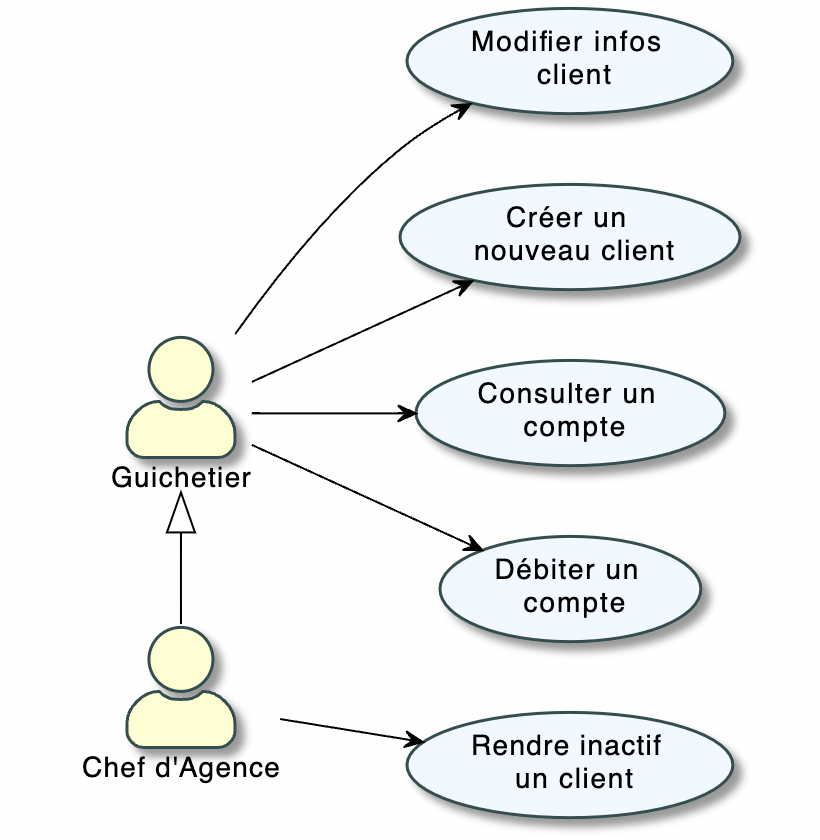

:toc: left                                                       
:toclevels: 4 
:toc-title: Sommaire
:nofooter:

= Cahier des charges V1 
MOINY Yanis <yanis.moiny@gmail.com>; MONTERDE Tonatiu <erwanmonterde@gmail.com>; MIQUEU-DENJEAN Vincent <vincent.miqueu@gmail.com>; WISSON Matthias <matthias.wisson@gmail.com> 
v1, 01/04/2022

[%hardbreaks]
Entreprise : DailyBank
Nom du projet : DailyBank
 
<<<
          
:sectnums:                                                          

:description: Example AsciiDoc document                             
:keywords: AsciiDoc                                                 
 

== [[bookmark-a]] Présentation du projet et mise en contexte

Le client s’attend à pouvoir régler ses problèmes à tout moment en ligne étant donné le nombre d’informations considérable auquel il a accès. Cela signifie qu’il espère aussi une réactivité plus importante et une disponibilité plus large de la part de sa banque. Au-delà de la réactivité, il a été démontré que les consommateurs sont désormais aussi à la recherche de simplicité, qu’ils sont impatients et que, contrairement à l’époque, ils peuvent être actifs dans la chaîne de valeur.
L’application doit permettre de gérer des comptes bancaires de dépôt pour des clients préalablement créés. Elle devra permettre de débiter, créditer un compte soit par virement c’est à dire un échange d’argent entre deux comptes distincts mais domiciliés dans le réseau bancaire, soit par une personne physique se présentant devant un guichet.

== Analyse de l’existant

La version existance (V0) permet au guichetier d'effectuer plusieurs actions, notamment :

* Modifier informations client (adresse, téléphone, …)
* Créer un nouveau client
* Consulter un compte
* Débiter un compte (BD)

Puis, dans cette même version, un chef d'agence peut :

* Rendre inactif un client

Diagramme des cas d'utilisation 

== Analyse des besoins V1

Cas d’utilisation à développer dans la Version 1 :

* Guichetier :

** Créditer/débiter un compte (java et BD avec procédure stockée)
** Créer un compte

** Effectuer un virement de compte à compte

** Clôturer un compte

* Chef d’Agence :

** Gérer (faire le « CRUD ») les employés (guichetier et chef d’agence)

== Analyse des contraintes 

=== Techniques

* Compétences : La connaissance des outils de développement afin de développer cette application JAVA-Oracle comme le langage de programmation (Java, Développement d'objets, Développement d'application avec IHM, Qualité de développement) nécessaire au développement d’un application est absolument nécessaire.

* Sécurité : Le but de cette application est de gérer des comptes , de ce fait les précédentes compétences seront indispensable afin de développer une application sécurisé 

=== Organisationnelles

* Planification : il s'agit de définir le ou les objectifs principaux de l'équipe de projet, de quelle manière celle-ci compte atteindre l'objectif, et l'équipement et/ou les étapes requises.

* Calendrier : l'équipe de gestion de projet doit définir le calendrier réaliste permettant de mener à bien chaque phase du projet.

* Surveillance : cette étape a lieu une fois le projet démarré. Il s'agit pour l'équipe de projet d'analyser le déroulement des étapes passées, de noter les tendances et impacts sur les plans futurs, et de communiquer ces informations à toutes les personnes concernées.

* Contrôle : lors de cette étape, l'équipe doit, en communiquant les résultats de chaque phase du projet, avancer en conséquence. Cela signifie que si les choses se passent bien, elle doit analyser les facteurs qui contribuent à ces résultats positifs afin qu'ils soient poursuivis et reproduits. Si un déraillement s'est produit, elle doit savoir comment et pourquoi, et prendre des mesures pour y remédier lors des futures étapes. 

Bien evidemment, un diagramme de Gantt sera très utile (voir indispensable) au déroulement et à l'organisation du projet.

