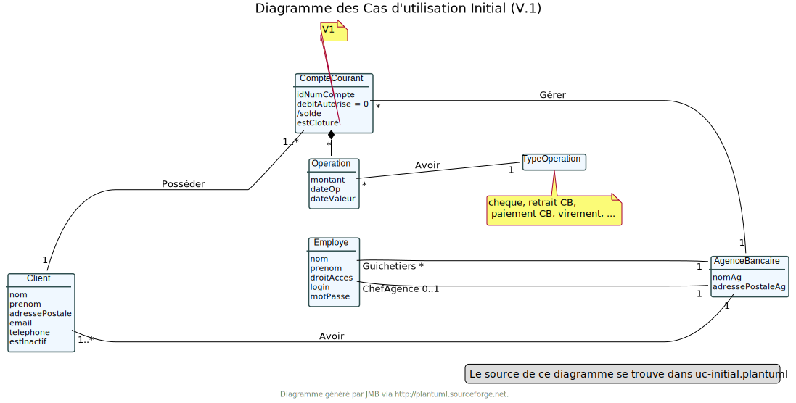
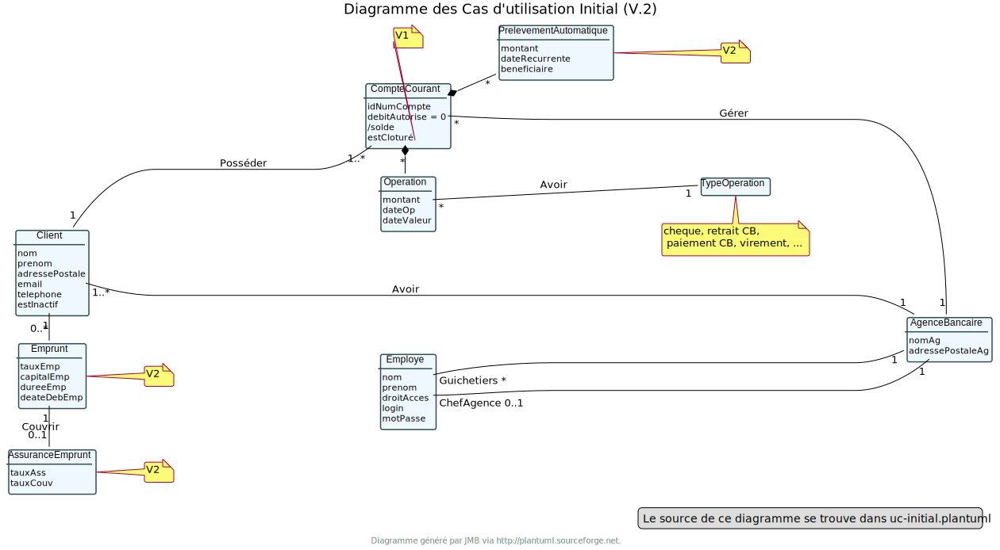

-Au lancement, le main lance DailyBankMainFrame.runApp();

application.control.DailyBankMainFrame ouvre une nouvelle fenêtre (dailybankmainframe.fxml) et initialise la connexion comme null.

application.view.DailyBankMainFrameController va être le contrôleur de la scène avec le contrôle sur les boutons et les actions à effectuer (Login, aide, quitter, etc...).

Puis quand on clique sur Connexion, LoginDialog se lance :
application.control.LoginDialog va alors ouvrir une nouvelle fenêtre (logindialog.fxml) qui va permettre à l'utilisateur de pouvoir rentrer un identifiant et un mot de passe pour se connecter en allant vérifier les informations saisies par l'utilisateur dans la base de données.

application.view.LoginDialogController va contrôler les actions à effectuer en fonctions des boutons et va retourner les potentielles erreurs d'identifiants incorrects.

= Dossier d’Analyse et de Conception
:toc:
:toc-title: Sommaire

Version de l'application : 1 +
Client : BankUniv +
Projet : Daily Bank + 

<<<

== 1. Architecture

=== a) Architecture Générale

Architecture de la V0 :
image:Images/dc-initialv0.svg[]
Architecture de la V1 :

Architecture de la V2 :

=== b) Ressources externes

L'application peut être lancé depuis l'éditeur "Oracle" ou via le fichier ".jar".
Notre application est lié à un compte Oracle qui permet la gestion des utilisateurs via la base de données.
Evidemment, il y un système d'authentification qui permet l'accès uniquement aux personnes autorisés.

=== c) Structure de l'application

Les packages :

* application +
DailyBank : main() qui lance l'application

* application.control + 
Regroupe tous les controleurs de notre application. Permet de gérer entre autre les fonctions et l'accès aux données.

* application.tools +
Outils supplémentaires de l'application (affichage d'alerte, liste de message, fonctions utilitaires etc...)

* application.view + 
Les fichiers dans le view sont les pages fxml édité sur SceneBuilder qui représente la partie frontend de l'application.
Il y a également les contrôleurs associés à ces fichiers fxml qui définissent l'action de chaque bouton etc...

* model.data + 
Fait le lien entre la base de données et l'application en gérant les tables de la BD.
On peut remarquer qu'un fichier java correspond à une table de la BD : Employé / Client / Opération etc...

* model.orm +
Fait le lien entre la base de données et l'application en gérant les tables de la BD.
Par exemple : 
    -Recherche d'un employe par son login / mot de passe
    -Méthode statique pour demander une connexion à la BD
    -etc...

* model.exception +
Regroupe toutes les exceptions possibles pour l'accès à notre base de données.