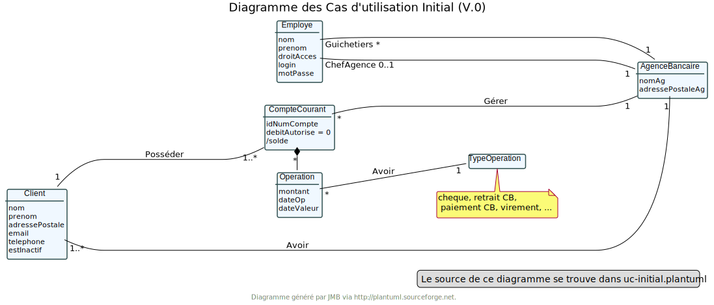
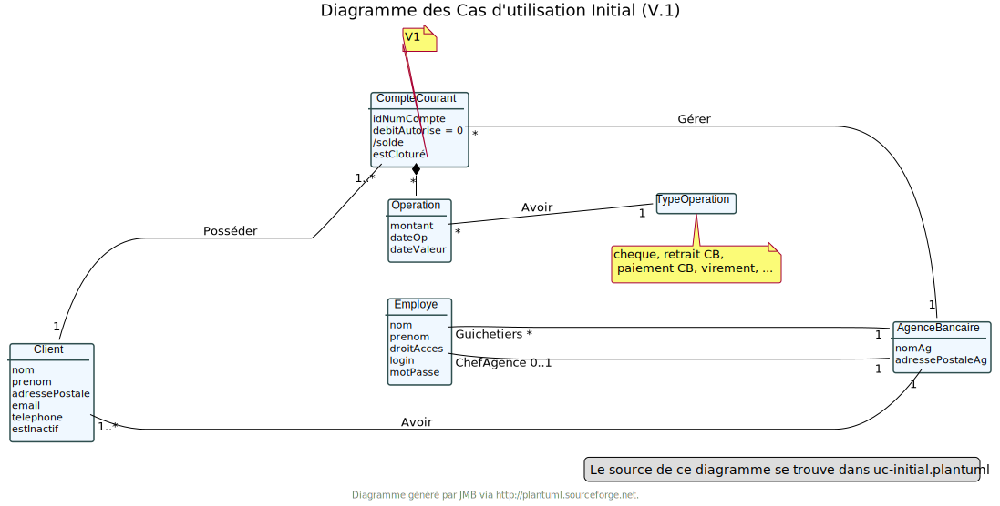
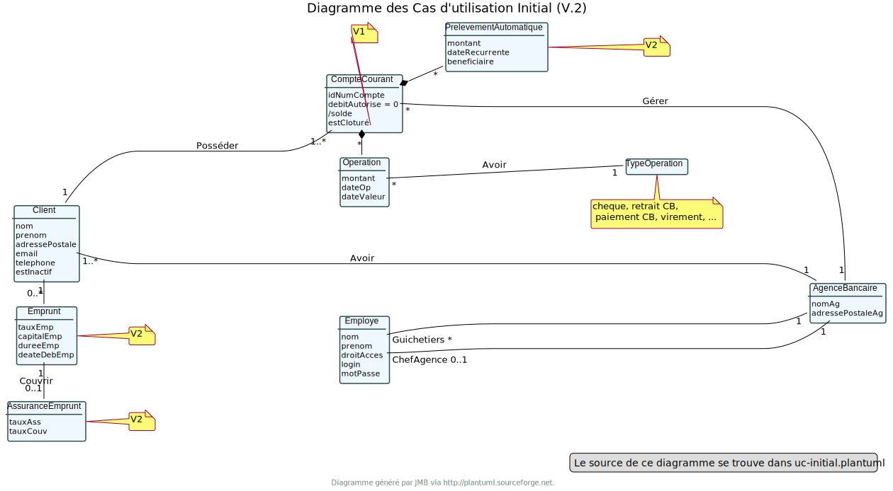

-Au lancement, le main lance DailyBankMainFrame.runApp();

application.control.DailyBankMainFrame ouvre une nouvelle fenêtre (dailybankmainframe.fxml) et initialise la connexion comme null.

application.view.DailyBankMainFrameController va être le contrôleur de la scène avec le contrôle sur les boutons et les actions à effectuer (Login, aide, quitter, etc...).

Puis quand on clique sur Connexion, LoginDialog se lance :
application.control.LoginDialog va alors ouvrir une nouvelle fenêtre (logindialog.fxml) qui va permettre à l'utilisateur de pouvoir rentrer un identifiant et un mot de passe pour se connecter en allant vérifier les informations saisies par l'utilisateur dans la base de données.

application.view.LoginDialogController va contrôler les actions à effectuer en fonctions des boutons et va retourner les potentielles erreurs d'identifiants incorrects.

= Dossier d’Analyse et de Conception
:toc:
:toc-title: Sommaire

Version de l'application : 1 +
Client : BankUniv +
Projet : Daily Bank + 

<<<

== 1. Architecture

=== a) Architecture Générale

Architecture de la V0 :

Architecture de la V1 :

Architecture de la V2 :

