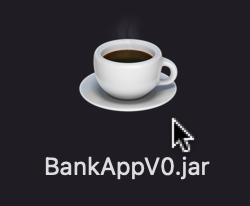
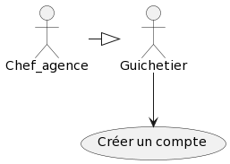
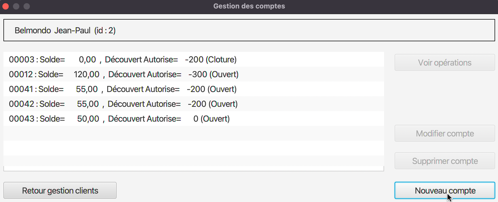
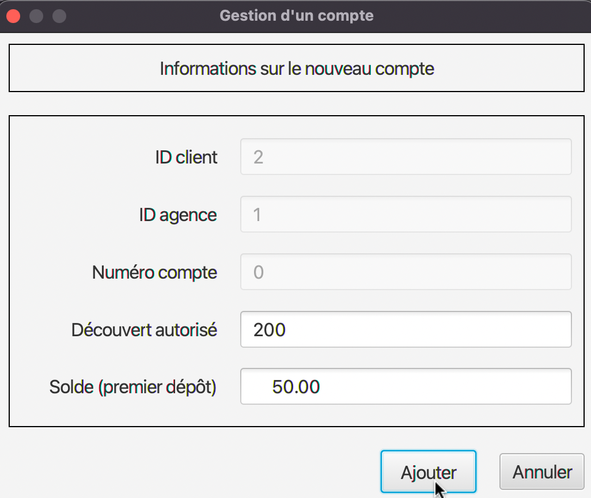
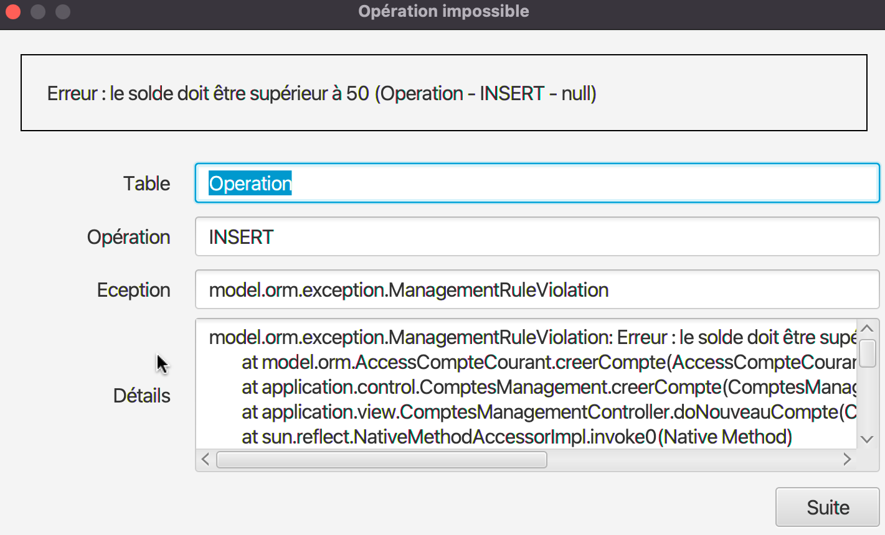
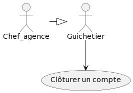
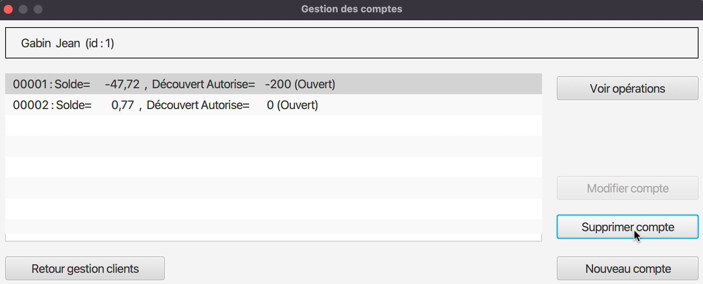
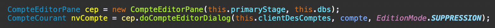
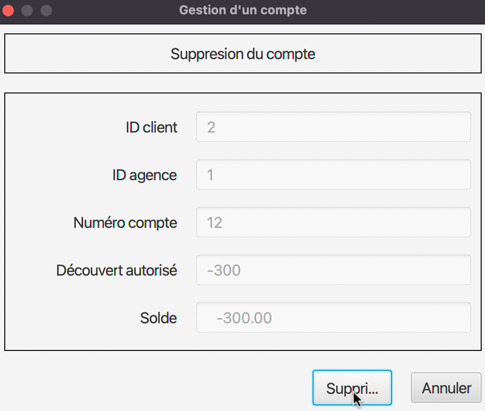

:toc: left                                                       
:toclevels: 4 
:toc-title: Sommaire
:nofooter:

= Documentation technique V1
Application : DailyBank

MOINY Yanis <yanis.moiny@gmail.com>; MONTERDE Tonatiu <erwanmonterde@gmail.com>; MIQUEU-DENJEAN Vincent <vincent.miqueu@gmail.com>; WISSON Matthias <matthias.wisson@gmail.com> 
v1, 20/05/2022
          
:sectnums:                                                        

:description: Example AsciiDoc document                             
:keywords: AsciiDoc                          

== [[bookmark-a]] Présentation générale, rôle de l' application

L'application DailyBank permet de gérer des comptes clients afin de remplacer plusieurs outils obsolètes.

Les besoins de la banque et des clients ayant évolué des fonctionnalités doivent être développés, une première version de l'application doit donc être améliorée afin de répondre aux besoins.

À ce jour l'application permet à un guichetier de : 

*** Modifier informations client (adresse, téléphone, …)
*** Créer un nouveau client
*** Consulter un compte
*** Créditer/débiter un compte (java et BD avec procédure stockée)
*** Créer un compte
*** Effectuer un virement de compte à compte
*** Clôturer un compte

Et permet à un chef d'agence de : 

*** Rendre inactif un client
*** Gérer (faire le « CRUD ») les employés (guichetier et chef d’agence)

== Architecture

=== Architecture Générale

L'application sera disponible sur toutes les machines des employés (guichetiers et chefs d'agences) dans toutes les agences.
L'application utilise Java 1.8, JavaFX pour l'interface et se connecte à une base de données Oracle.

=== Ressources externes

Le fichier .jar permet l'exécution par l'utilisateur de l'application. 

La https://github.com/IUT-Blagnac/sae2022-bank-1b4/blob/main/DOC_UTIL/Doc_Util_V2.adoc[Documentation Utilisateur] pourra vous aider afin de connaître les différentes fonctionnalités du point de vue de l’utilisateur. Une base de données Oracle est utilisée par cette application, la connexion est établie dans la classe LogToDatabase.java, package "model.orm".

=== Structuration en packages

==== Les packages :

* application +
DailyBank : main() de départ

* application.control + 
Contrôleurs de dialogue et accès aux données : gestion des fonctions de l’application

* application.view +
Vues de l’application - fichiers fxml et contrôleurs associés - : gestion des vues uniquement : affichages, contrôle de saisies, …

* application.tools + 
Utilitaires pour application.view et application.control

* model.data + 
Classes java mappant les table de la BD. Une table ⇒ 1 classe.

* model.orm +
Classes d’accès physiques à la BD. Une table ⇒ 1 classe offrant différentes méthodes pour accéder à la table : select, insert, delete, update, appel de procédure stockée.

* model.exception +
Classes des exceptions spécifiques d’accès à la BD, levées par les classes de model.orm

A chaque page est associée une vue FXML, un controleur de vue et une classe qui lance la page.

===== MVC

Si on prend le modèle MVC pour l’application entière, on a :

* Modèle :

** model.orm : le "vrai" modèle

** model.data : classes nécessaires pour transporter les données

* Vue :

** application.view : toutes les parties visibles de l’utilisateur, sans accès aux données, sans accès les unes aux autres

* Contrôleur :

** application.control : classes de contrôle du "déroulement"

*** Routage entre fenêtres

*** Accès aux données lorsque de besoin

** application avec la classe DailyBank : main() de lancement de l’application. Et encore, elle ne fait que faire un runApp() sur un contrôleur.

* Le reste est juste de "l’aide" :

** model.exception

** application.tools

===== Rôles de chaque classe dans les packages

* application

** DailyBank : main() de l’application

** DailyBankState : classe de description du contexte courant de l’application : qui est connecté ? est-il chef d’agence ? à quelle agence bancaire appartient-il ?

* application.control

** Une classe par fenêtre dite contrôleur de dialogue. Exemple LoginDialog

** Rôles de chaque classe :

*** A la création : i) construit le Stage java FX de la fenêtre, ii) charge le fichier fxml de la vue et son contrôleur

*** Offre une méthode de démarrage du Dialogue, du type doNomClasseControlDialog(…). Exemple doLoginDialog()

*** Offre des méthodes d’accès aux données, disponibles pour son contrôleur de vue

*** Offre des méthodes d’activation d’autres fenêtres, disponibles pour son contrôleur de vue

* application.view

** Une classe par fenêtre dite contrôleur de vue ET un fichier fxml associé. Exemple LoginDialogController et logindialog.fxml

** Un objet d’une telle classe ne connaît de l’application que son contrôleur de dialogue (de application.control)

** Rôles de chaque classe :

*** Offre une méthode initContext(…) pour être initialisée. Appelée par le contrôleur de dialogue

*** Offre une méthode displayDialog(…) pour afficher la fenêtre. Appelée par le contrôleur de dialogue

*** Gère toutes les réactions aux interactions : saisies, boutons, …

*** Met à jour l’interface lorsque de besoin : griser des boutons, remplir des champs, …

*** Effectue tous les contrôles de surface au niveau de la saisie : valeurs remplies, nombres < 0, …

*** Appelle son contrôleur de vue si besoin d’accéder à des données

*** Appelle son contrôleur de vue si besoin de lancer une autre fonction (fenêtre) de l’application

* model.data

** Classes java mappant les table de la BD.

*** Une table ⇒ 1 classe. On peut en ajouter (classes pour jointures, …)

** Servent à échanger les donnes entre model.orm et application.control

** Ces classes ne définissent aucune méthode qui "fait quelque chose" (calcul, …). Les attributs sont public et une seule méthode toString (). Chaque attribut est un champ de la table.

** Ces classes ne contiennent que les champs de la BD que l’on souhaite remonter vers l’application.

* model.orm

** Classes d’accès physiques à la BD.

*** Une table ⇒ 1 classe offrant différentes méthodes pour accéder à la table : select, insert, delete, update, appel de procédure stockée (elles sont données). On peut en ajouter.

** Chaque classe : effectue une requête SQL, presque la requête qu’on ferait au clavier envoyée au serveur sous forme de String. Ensuite elle emballe le résultat en java (objets de model.data, ArrayList, …).

A part :

* model.exception

** A voir sur le code lorsque de besoin.

* application.tools

** A voir sur le code lorsque de besoin

== Fonctionnalités

=== Créer un compte (Moiny Yanis)

Use case :

Classes utilisées :: 

* application.control :  
** `ComptesManagement`
** `ComptesEditorPane`

* application.view :
** `ComptesManagementController`
** `ComptesEditorPaneController`

* model.orm :
** `AccessComptesCourant`

* model.data : 
** `ComptesCourant`

* model.orm :
** `AccessOperation`

Accessibilité : Guichetier et Chef d'agence +

Action de création d'un compte. +
Fonctionnement dans le code : lorsque l'utilisateur clique sur le bouton "Nouveau compte", le contrôleur de vue `ComptesManagementController` transfère les informations nécessaires au contrôle `ComptesManagement` pour l'affichage de la page.

Ensuite, pour enregistrer le compte, la classe contrôle `CompteEditorPane` est utilisée, elle va afficher la page pour créer le compte et transmettre les informations au controleur de vue `CompteEditorPaneController`.

Les entrées de l'utilisateur sont controlées lorsqu'il tente de valider la création en cliquant sur le bouton Ajouter, si tout est correct la création est créée et le contrôle `ComptesManagement` peut enfin se connecter à la base de données et effectuer la création. La création dans la base de données est effectué en utilisant la classe ORM `AccessComptesCourant`. +

Conditions de validation de l'opération : Le premier depôt (solde) doit être supérieur à 50 euros sinon erreur (Voir image ci-dessous) +

=== Clôturer un compte (Moiny Yanis)

Use Case :

Classes utilisées ::

* application.control :  
** `ComptesManagement`

* application.view :
** `ComptesManagementController`

* model.orm :
** `AccessComptesCourant`

* model.data : 
** `ComptesCourant`

* model.orm :
** `AccessOperation`

Accessibilité : Guichetier et Chef d'agence +

Action de suppression d'un compte. +

Fonctionnement dans le code : lorsque l'utilisateur clique sur le bouton "Supprimer compte", le contrôleur de vue `ComptesManagementController` transfère les informations nécessaires au contrôle `ComptesManagement`. 

Ensuite, pour supprimer le compte, la classe contrôle `CompteEditorPane` est utilisée, elle va afficher la page pour supprimer le compte. 

En cliquant sur le bouton Supprimer, la suppression est créée et le contrôle `ComptesManagement` peut enfin se connecter à la base de données et effectuer la suppression si le solde du compte est égal à 0. 

La suppression dans la base de données est effectué en utilisant la classe ORM `AccessComptesCourant`. +
`AccesCompteCourant` va modifier "estCloture" du compte sélectionné pour mettre "O" (signifiant oui).