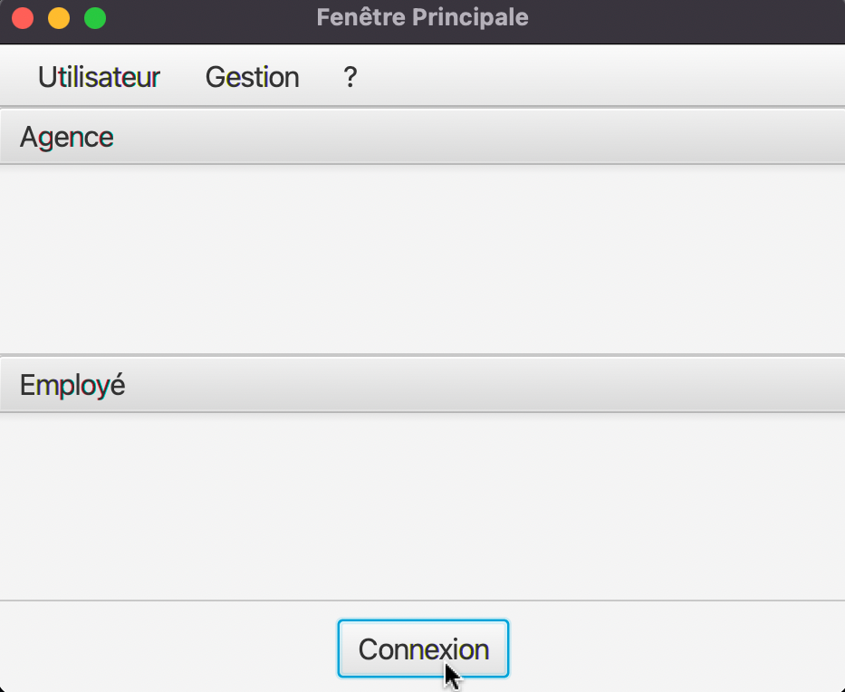
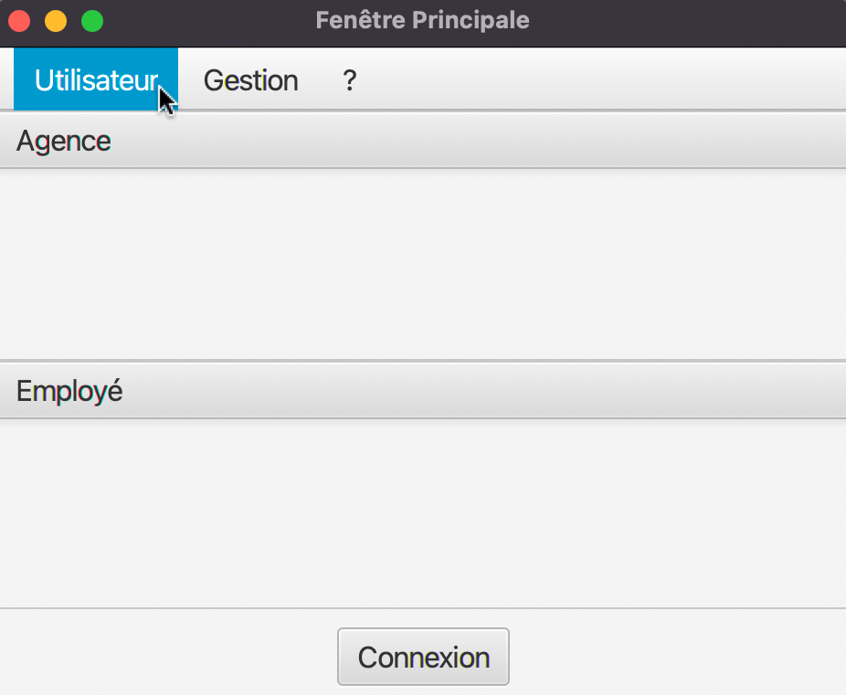
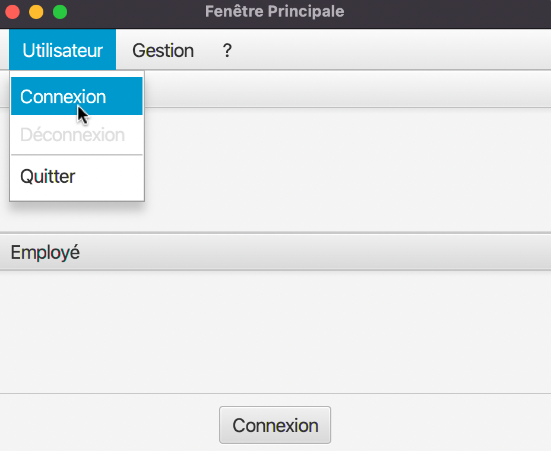
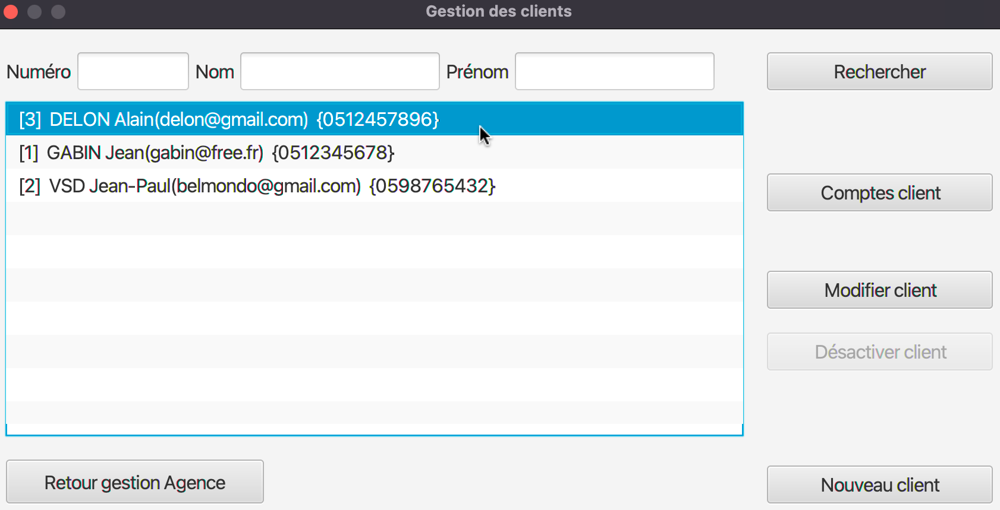

:toc: left                                                       
:toclevels: 4 
:toc-title: Sommaire
:nofooter:

= Documentation utilisateur V0

MOINY Yanis <yanis.moiny@gmail.com>; MONTERDE Tonatiu <erwanmonterde@gmail.com>; MIQUEU-DENJEAN Vincent <vincent.miqueu@gmail.com>; WISSON Matthias <matthias.wisson@gmail.com> 
v1, 19/04/2022
          
:sectnums:                                                          

:description: Example AsciiDoc document                             
:keywords: AsciiDoc                                                 
 

== [[bookmark-a]] Présentation générale, rôle de l' application

L'application DailyBank permet de gérer des comptes clients afin de remplacer plusieurs outils obsolètes.

Les besoins de la banque et des clients ayant évolué des fonctionnalités doivent être développés, une première version de l'application doit donc être améliorée afin de répondre aux besoins.

À ce jour l'application permet à un guichetier de : 

*** Modifier informations client (adresse, téléphone, …)
*** Créer un nouveau client
*** Consulter un compte
*** Débiter un compte (BD)

Et permet à un chef d'agence de : 

*** Rendre inactif un client

== Installation 

=== Avant d'installer 

Afin d'exécuter l'application DailyBankApp assurez-vous d'avoir installé Java 1.8. Dans le cas où vous auriez d'autres versions de Java installées, il faut définir votre version principale en Java 1.8.

=== Télécharger/lancer le .jar

Il ne vous reste plus qu'à télécharger le fichier .jar afin de le lancer : :: 
Pour cela cliquez tout simplement sur https://github.com/IUT-Blagnac/sae2022-bank-1b4/tree/main/CODE_SOURCE/src[ce lien] et téléchargez le fichier 

==== Une version 

Si vous possédez qu'une seule version Java, double cliquez sur le fichier precedemment installé

image::Images/telBankApp.png[]

==== Plusieurs versions

Si vous possédez plusiseurs version Java, ouvrez un terminal puis dirigez vous vers le dossier où se trouve le .jar

image::Images/cheminJar.png[]

et entrez la commande #java -jar BankAppV0.jar#

==  Utilisation

Maintenant que vous avez réussi à télécharger l'application il vous reste à apprendre comment l'utiliser pour cela le tutoriel se présentera en plusieurs étapes.

=== Connexion

La première étape est de se connecter à l'application bien evidemment ::

* Pour cela cliquez sur le bouton connexion centré en bas de l'application

* Ou bien cliquez sur le bouton utilisateur pour faire apparaître le bouton connexion que vous devrez ensuite cliquer

* Il ne vous reste plus qu'à rentrer vos identifiants (login et mot de passe)

image::Images/coIdMdp.png[]

=== Utilisation/Fonctionnement

Après la connexion vous pouvez accéder à plusieurs fonctionnalités en tant que guichetier : ::

* Tout d'abord rendez-vous vers le menu des fonctionnalités en cliquant sur le bouton Gestion puis Clients

image::Images/gestClients1.png[]

image::Images/gestClients2.png[]

==== Recherche client

* Afin de rechercher un client vous pouvez cliquer sur le bouton Rechercher après avoir entrer (ou non) des critères de recherches dans les zones de texte dédiés à cela

image::Images/rechClient.png[]

=== Modifier info client

Après avoir recherché un client vous pouvez le selectionner en cliquant dessus, cela vous débloquera un bouton modifier client, cliquez dessus.

image::Images/cliqueModifClient.png[]

=== Résultats produits avec jeux d'essai commentés

