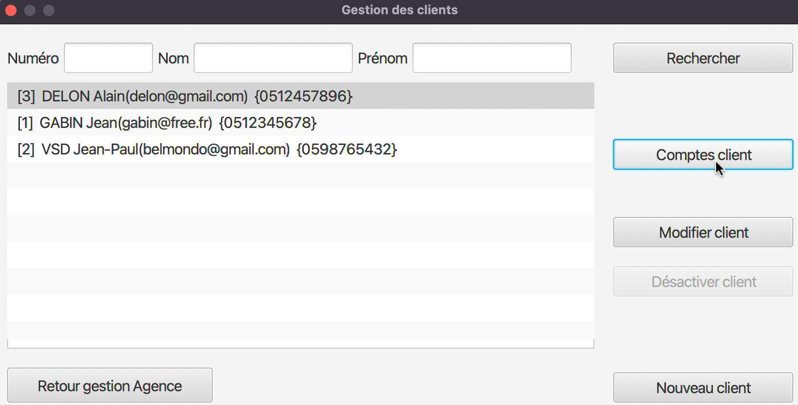
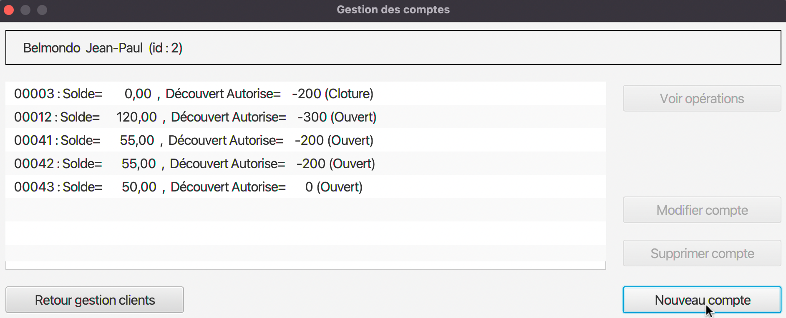
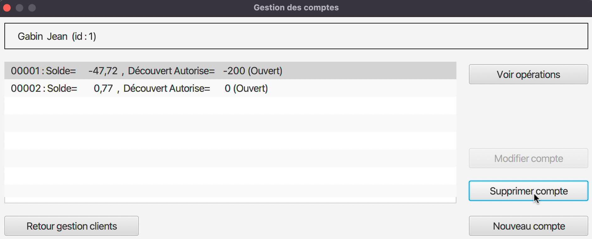

:toc: left                                                       
:toclevels: 4 
:toc-title: Sommaire
:nofooter:

= Documentation utilisateur V1

MOINY Yanis <yanis.moiny@gmail.com>; MONTERDE Tonatiu <erwanmonterde@gmail.com>; MIQUEU-DENJEAN Vincent <vincent.miqueu@gmail.com>; WISSON Matthias <matthias.wisson@gmail.com> 
v1, 25/04/2022
          
:sectnums:                                                        

:description: Example AsciiDoc document                             
:keywords: AsciiDoc                                                 
 

== [[bookmark-a]] Présentation générale, rôle de l' application

L'application DailyBank permet de gérer des comptes clients afin de remplacer plusieurs outils obsolètes.

Les besoins de la banque et des clients ayant évolué des fonctionnalités doivent être développés, une première version de l'application doit donc être améliorée afin de répondre aux besoins.

À ce jour l'application permet à un guichetier de : 

*** Modifier informations client (adresse, téléphone, …)
*** Créer un nouveau client
*** Consulter un compte
*** Créditer/débiter un compte (java et BD avec procédure stockée)
*** Créer un compte
*** Effectuer un virement de compte à compte
*** Clôturer un compte

Et permet à un chef d'agence de : 

*** Rendre inactif un client
*** Gérer (faire le « CRUD ») les employés (guichetier et chef d’agence)

== Installation 

=== Avant d'installer 

Afin d'exécuter l'application DailyBankApp assurez-vous d'avoir installé Java 1.8. Dans le cas où vous auriez d'autres versions de Java installées, il faut définir votre version principale en Java 1.8.

=== Télécharger/lancer le .jar

Il ne vous reste plus qu'à télécharger le fichier .jar afin de le lancer : :: 
Pour cela cliquez tout simplement sur https://github.com/IUT-Blagnac/sae2022-bank-1b4/tree/main/CODE_SOURCE/src[ce lien] et téléchargez le fichier 

==== Une version 

Si vous possédez qu'une seule version Java, double cliquez sur le fichier precedemment installé

==== Plusieurs versions

Si vous possédez plusiseurs version Java, ouvrez un terminal puis dirigez vous vers le dossier où se trouve le .jar

et entrez la commande #java -jar BankAppV0.jar#

==  Utilisation

Maintenant que vous avez réussi à télécharger l'application il vous reste à apprendre comment l'utiliser pour cela le tutoriel se présentera en plusieurs étapes.

=== Connexion

La première étape est de se connecter à l'application bien evidemment ::

* Pour cela cliquez sur le bouton #Connexion# centré en bas de l'application

image::Images/coAppli.png[]

* Ou bien cliquez sur le bouton #Utilisateur# pour faire apparaître le bouton #Connexion# que vous devrez ensuite cliquer

image::Images/coAppli2.png[]

image::Images/coAppli3.png[]

* Il ne vous reste plus qu'à rentrer vos identifiants (login et mot de passe)

=== Utilisation/Fonctionnement

Après la connexion vous pouvez accéder à plusieurs fonctionnalités en tant que guichetier : ::

* Tout d'abord rendez-vous vers le menu des fonctionnalités en cliquant sur le bouton #Gestion# puis #Clients#

==== Recherche client

[[bookmark-c]]

* Afin de rechercher un client vous pouvez cliquer sur le bouton #Rechercher# après avoir entrer (ou non) des critères de recherches dans les zones de texte dédiés à cela

image::Images/rechClient.png[]

==== Modifier info client

Après avoir recherché un client vous pouvez le selectionner en cliquant dessus, cela vous débloquera un bouton #Modifier Client#, cliquez dessus.

image::Images/cliqueRechClient.png[]

Une fois que vous êtes dans la page dédié à la modification des informations d'un client vous pouvez modifier parmi le nom, prénom, l'adresse, le téléphone, l'adresse mail et si le client est actif ou non. ::
Quand vous avez fini de modifier les informations du client cliquez sur le bouton #Modifier#.

==== Créer un nouveau client

Toujours dans la fenêtre de recherche de cliens après avoir rechercher un client ::

link:#bookmark-c[Explications]

Pour créer un nouveau cliquez sur le bouton #Nouveau client#

==== Consulter un compte 

[[bookmark-b]]
[[bookmark-d]]
Toujours dans la fenêtre de recherche de cliens après avoir rechercher un client ::

link:#bookmark-c[Explications]

Pour consulter un compte cliquez sur le bouton #Comptes Client#

Sélectionnez le compte que vous souhaitez consulter et cliquez sur le bouton #Voir opérations#

Cela vous ouvrera une fenêtre avec les informations du compte.

==== Créditer/Débiter un compte

Dans la fenêtre de gestion des opérations :: 
link:#bookmark-b[Explications]

Pour débiter un compte cliquez sur le bouton #Enregistrer Débit# 

Vous pouvez choisir entre 2 types d'opérations (Retrait Espèces, Retrait Carte Bleue)

Ainsi que préciser le montant que souhaitez débiter.

Enfin, pour valider votre débit, cliquez sur le bouton #Effectuer Débit#

``Créditer un compte en cours de développement...``

==== Créer un compte 

Dans la fenêtre de gestion de compte ::

link:#bookmark-d[Explications]

Cliquez sur le bouton #Nouveau compte# cela vous ouvrira une nouvelle fenêtre...

Vous pouvez entrer un découvert autorisé et un solde (premier dépôt). 
`*_Attention ce premier depôt doit être supérieur à 50 euros._*`

image::Images/gestionSolde.png[]

Enfin cliquez sur le bouton #Ajouter# afin de créer le compte.

image::Images/ajouterCompte.png[]

==== Effectuer un virement de compte à compte

``Effectuer un virement de compte à compte en cours de développement...``

==== Clôturer un compte

Dans la fenêtre de gestion de compte ::

link:#bookmark-d[Explications]

Afin de clturer un compte, cliquez sur un compte et cliquez sur le bouton #Supprimer compte#

==== Gérer (faire le « CRUD ») les employés (guichetier et chef d’agence)

``Gérer (faire le « CRUD ») les employés (guichetier et chef d’agence) en cours de développement en cours de développement...``

